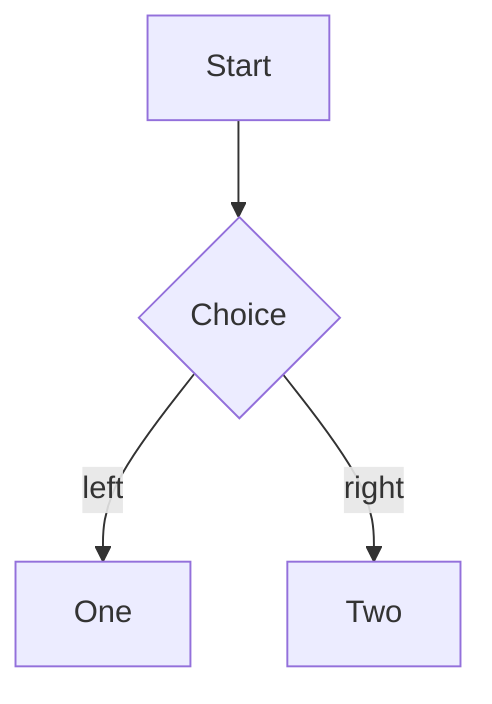

# Broken and dark

A diagram with a mistake keeps its source, with the reason as a tooltip.

```mermaid
flowchart LR
  A -->
```

A working one, in whichever colours the system is using:

```mermaid
flowchart TD
  A[Start] --> B{Choice}
  B -- left --> C[One]
  B -- right --> D[Two]
```
