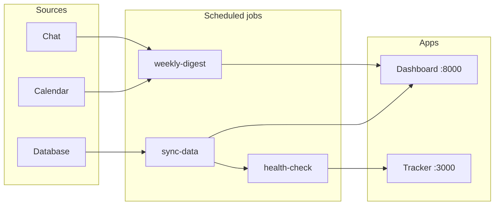
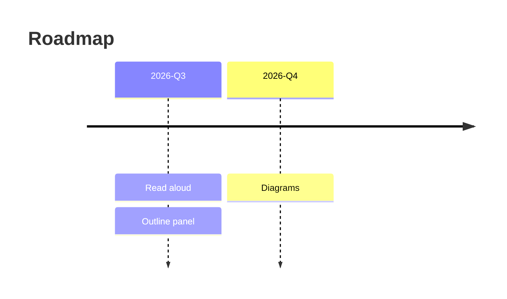

# Diagram check

A flowchart with groups, a timeline, and one broken diagram.

```mermaid
flowchart LR
  subgraph SRC["Sources"]
    A1["Database"]
    A2["Calendar"]
    A3["Chat"]
  end
  subgraph JOBS["Scheduled jobs"]
    B1["sync-data"]
    B2["weekly-digest"]
    B3["health-check"]
  end
  subgraph APPS["Apps"]
    C1["Dashboard :8000"]
    C2["Tracker :3000"]
  end
  A1 --> B1 --> C1
  A2 --> B2 --> C1
  A3 --> B2
  B1 --> B3
  B3 --> C2
```

```mermaid
timeline
  title Roadmap
  2026-Q3 : Read aloud : Outline panel
  2026-Q4 : Diagrams
```

```mermaid
flowchart LR
  A --> 
```
